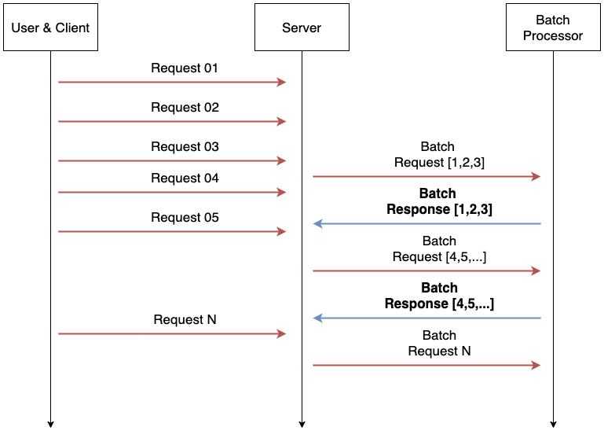

# FastAPI Model Micro Batching Serving Sample using Service Streamer

FastAPI DL Model Serving Sample

micro batch  depens on [Service Streamer](https://github.com/ShannonAI/service-streamer)





# Project Structur

```
.
├── app_v1
├── app_v2
│   ├── manager # model micro batch manager
│   │   ├── __init__.py
│   │   └── resnet.py
│   ├── routers
│   │   ├── __init__.py
│   │   └── resnet.py
│   ├── schema.py
│   ├── services
│   │   ├── __init__.py
│   │   └── resnet.py
│   ├── dependencies.py
│   ├── main.py
│   └── settings.py
├── imagenet_classes.txt
├── model_store
│   ├── classifier.zip
│   └── embedding.zip
├── README.md
└── requirements.txt

```

# docker-compose 

```yaml

version: "3.8"

services:
  api:
    build: .
    restart: unless-stopped
    command: uvicorn app_v2.main:app --host 0.0.0.0  --workers 1 --port 8000 --log-config ./log.ini
    ports:
      - "8000:8000"
    expose:
      - 8000
    volumes:
      - ./log:/app/log:rw

    environment:
      DL_EMBEDDING_MODEL_PATH: model_store/embedding.zip
      DL_CLASSIFIER_MODEL_PATH: model_store/classifier.zip
      CLASSES_PATH: imagenet_classes.txt

      MB_BATCH_SIZE: 256
      MB_MAX_LATENCY: 1 # Sec
      MB_WORKER_NUM: 1

      CUDA_DEVICE: cuda
      CUDA_DEVICES: "[0]"

    deploy:
      resources:
        reservations:
          devices:
            - driver: nvidia
              device_ids: [ '0' ]
              capabilities: [ gpu ]

    healthcheck:
      test: curl --fail http://localhost:8000/health || exit 1
      interval: 60s
      retries: 5
      start_period: 30s
      timeout: 5s


```


# Requirements

- torch==1.10.1
- torchvision==0.11.2
- fastapi[all]==0.80.0
- fastapi-restful==0.4.3
- fastapi-health==0.4.0
- service-streamer==0.1.2
- pydantic==1.9.2


